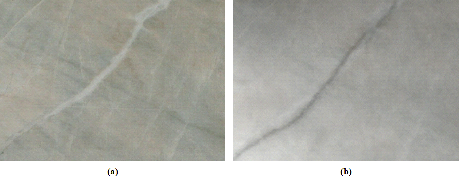

# Marble Crack Segmentation 2 (MCS2) Dataset

Marble surface crack detection is crucial to preserve the high quality and aesthetic value of structures, and thus to prevent the risks of their early deterioration and natural decay through maintenance actions.
To date, marble surface crack detection is performed manually by experienced human inspectors.
However, cracks may be too thin and difficult to be detected by observation, especially in randomly textured marble surfaces.
Automated methods to facilitate or entirely

The dataset was generated in four successive steps. 
In the first step, 38 marble tiles with cracks were handpicked by a domain expert from the production line of the marble quarrying company Solakis S.A. in Drama, Greece. 
Four sizes of tiles were used: 20×40 cm, 30×60 cm, 40×40 cm, and 50×60 cm with hairline cracks of up to 2 mm wide.
In the second step, all tiles were photographed at a steady distance of 90 cm using an MVLMF0824M-5MP lens mounted on an MV_CA050- 10GM/GC digital camera.
This method was complemented by an automatic screening machine with a diffusion box designed and implemented by In-termek A.B.E.E. in Kavala, Greece.
The process resulted in the high-resolution RGB images of the tiles used in this work.
The thermal images were obtained in the third step in the laboratories of the International Hellenic University, in Kavala Campus, Greece.
The tiles were first heated with an infrared source and then scanned with the thermal heat-sensitive 206×156 Seek Compact XR camera, focused on the cracked areas.
In the final step, the RGB and thermal images were first paired, and then the visible cracks were manually annotated by a domain expert using the LabelMe annotation tool.
The original dataset comprised of 24 pairs of thermal and RGB images.

<p align="center">
    
</p>


# Dataset Properties

* Total samples: 24
* Number of classes: 2 (0: background, 1: crack)
* Image format: jpg/png
* Image size: Variable; From 509x395 up to 874x638

## Structure
```
.
dataset
    ├───RGB
    │   ├───images
    │   │       01.png
    │   │       02.png
    │   │       03.png
    │   │       ...
    │   └───masks
    │           01.png
    │           02.png
    │           03.png
    │           ...
    └───Thermal
        ├───images
        │       01.jpg
        │       02.jpg
        │       03.jpg
        │       ...
        └───masks
                01.png
                02.png
                03.png
                ...
```

* Each image's corresponding mask has the same name (but with a png extention).
* RGB images and their corresponding Thermal ones have the same dimensions.

# Citation

If you use the dataset in a scientific publication, please cite us using the following bibtex citation:
```
@INPROCEEDINGS{10174288,
  author={Vrochidou, Eleni and Sidiropoulos, George K. and Tsimperidis, Ioannis and Ouzounis, Athanasios G. and Sarafis, Ilias T. and Kalpakis, Vassilis and Stamkos, Andreas and Papakostas, George A.},
  booktitle={2023 IEEE World AI IoT Congress (AIIoT)},
  title={Fusion of Thermal and RGB Images for Automated Deep Learning Based Marble Crack Detection},
  year={2023},
  volume={},
  number={},
  pages={0243-0249},
  doi={10.1109/AIIoT58121.2023.10174288}
}
```

# License

Attribution 4.0 International
